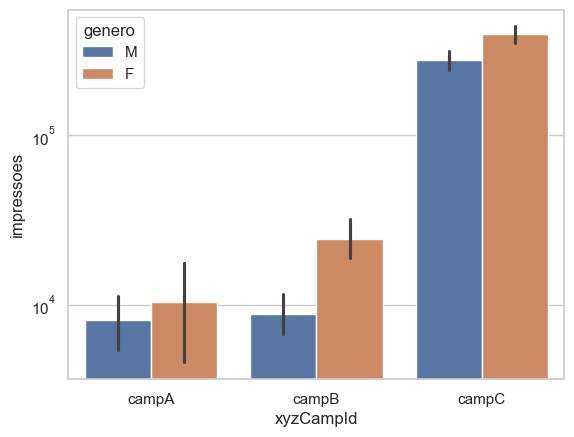

## Análise Estratégica de Campanhas Publicitárias no Facebook

O projeto foca na análise de campanhas de anúncios no Facebook para determinar os melhores segmentos de clientes. Nesta análise foi explorado dados demográficos, comportamentais e de engajamento para identificar padrões e insights que possam orientar a otimização das campanhas. Com base nessa análise, irei sugerir ações estratégicas para aprimorar a segmentação e o direcionamento dos anúncios, visando resultados mais eficientes e eficazes.

## Descrição do Dataset:

Conjunto de dados: [disponível no Kaggle](https://www.kaggle.com/datasets/loveall/clicks-conversion-tracking)

Os dados utilizados neste projeto provêm de uma campanha publicitária nas redes sociais de uma organização anônima. O dataset conversion_data.csv contém 1143 observações em 11 variáveis. Seguem-se as descrições das variáveis.

Glossário do conjunto de dados:

* `ad_id` -  um ID único para cada anúncio.
* `xyz_campaign_id` - um ID associado a cada campanha de anúncios da empresa XYZ.
* `fb_campaign_id` - um ID associado ao rastreamento de cada campanha pelo Facebook.
* `age` - idade da pessoa a quem o anúncio é exibido.
* `gender`- gênero da pessoa a quem o anúncio é exibido.
* `interest`- um código especificando a categoria à qual pertence o interesse da pessoa (interesses mencionados no perfil público do Facebook da pessoa).
* `Impressions`- o número de vezes que o anúncio foi exibido.
* `Clicks`- número de cliques no anúncio.
* `Spent`- cor do item comprado.
* `Total conversion`- valor pago pela empresa XYZ ao Facebook para exibir o anúncio.
* `Review Rating`- número total de pessoas que se informaram sobre o produto após verem o anúncio.
* `Approved conversion`- número total de pessoas que compraram o produto após verem o anúncio.

## Etapas do Projeto:

* **Conhecendo o Dataset**: Importação das bibliotecas necessárias e leitura do conjunto de dados.
* **Análises Preliminares**: Exploração inicial dos dados, com o objetivo de responder perguntas e obter insights importantes.
* **Visualização dos Dados**: Utilização de gráficos e histograma para entender a distribuição dos dados e identificar possíveis outliers. Também plotagem de gráficos de dispersão para observar as relações entre as variáveis.

## Análise Exploratória dos Dados

- Do autor:

- **Grupo Etário 30-34 anos:** Tanto as conversões totais quanto as aprovadas apresentam uma forte correlação positiva com o grupo etário de 30-34 anos. Este grupo demonstrou uma tendência acentuada a solicitar informações e efetuar compras, em comparação com outros grupos etários.

- **Cliques por Grupo Etário:** Os cliques estão mais associados aos grupos etários de 40-44 e 45-49. Isto sugere que clientes mais velhos têm uma maior propensão a clicar nos anúncios. No entanto, quando analisamos as conversões para esses grupos etários, a correlação é negativa, indicando uma taxa de conversão menor em comparação com os grupos mais jovens

- **Diferenças de Gênero:** Mulheres são mais propensas a clicar nos anúncios e a solicitar informações sobre o produto. Contudo, após a solicitação, os homens tendem a realizar mais compras.

- **Campanhas Publicitárias:** As Campanhas A e B foram mais direcionadas a clientes jovens, evidenciado pela correlação positiva com o grupo etário de 30-34 anos. Em contraste, a Campanha C focou em clientes mais velhos, como indicado pela correlação negativa com o grupo etário de 30-34 anos.

- **Correlação com Variáveis Não Demográficas:** Variáveis não demográficas são influenciadas pela discrepância significativa entre o número de impressões e o número efetivo de anúncios.

## Análise Detalhada da Campanha

Do autor:

- Devido à distribuição desigual tanto dos anúncios individuais quanto das impressões de cada campanha, é necessário incluir indicadores-chave de desempenho adicionais, como a taxa de cliques (CTR), o custo por clique (CPC), a taxa de conversão e o custo de aquisição de clientes (CAC).

- Assume-se que o CAC considera que cada link de anúncio direciona para a mesma página de destino e, portanto, os clientes têm a mesma experiência de compra.

- Além disso, poderíamos utilizar o retorno sobre o gasto com publicidade (ROAS) para obter uma análise mais abrangente. No entanto, devido à falta de informações sobre o valor dos clientes e o custo do produto envolvido no anúncio, assumiremos que a empresa está promovendo widgets com o mesmo preço em todas as campanhas, e que diferentes grupos demográficos de clientes (como mulheres, na faixa etária de 30 a 34 anos) possuem o mesmo valor de vida útil do cliente. Embora essa abordagem não seja ideal, permitirá uma análise mais simplificada.

---

Do autor:
- Sem surpresas aqui, a Campanha C apresenta o maior gasto com anúncios e o maior número de conversões, o que está em linha com suas altas impressões mostradas no gráfico anterior

---

Do autor:
- Aqui observamos que tanto a Campanha A quanto a Campanha B apresentam taxas de cliques (CTR) mais altas, indicando que elas possuem uma mensagem mais eficaz ou um melhor direcionamento do que a Campanha C. Vamos investigar isso mais a fundo.

---

Do autor:
- As Campanhas A e B têm taxas de conversão muito maiores do que a Campanha C. No entanto, ao analisar a taxa de conversão total da empresa, observamos apenas 2,83%, devido à grande proporção de conversões aprovadas que a Campanha C representa em comparação com as demais

---

Do autor:
- A Campanha C tem um Custo de Aquisição de Cliente (CAC) mais de quatro vezes superior ao da Campanha B. Além disso, sua CTR mais baixa sugere que a mensagem não está atraindo bem os clientes. Isso, combinado com o CAC elevado, indica que os clientes que clicam no anúncio podem não estar interessados no produto. Vamos verificar se o custo por clique da Campanha C é mais alto em comparação com as outras campanhas.

---

Do autor:
- O Custo por Clique (CPC) da Campanha C é o mais alto, no entanto, essa diferença não justifica o CAC muito maior que a Campanha C apresenta.

## Gênero

Do autor:
- Podemos notar que, entre as pessoas que visualizaram o anúncio em todas as campanhas, 54% eram mulheres e 46% eram homens.

---

Do autor:
- As mulheres têm uma taxa de cliques (CTR) superior à dos homens.

---

Do autor:
- Embora as mulheres tenham uma taxa de cliques (CTR) mais alta, os homens têm quase o dobro de probabilidade de concluir uma compra após acessar o site.

---

Do autor:
- Assim, devido ao CTR e à taxa de conversão, o CAC dos homens é apenas 2/3 do das mulheres.

## Gênero por campanha

Do autor:
- Em todas as campanhas, as mulheres estão mais expostas aos anúncios.

---

Do autor:
- Além disso, elas apresentam uma taxa de cliques (CTR) e um custo de aquisição de clientes (CAC) mais altos em todas as campanhas, com uma conversão mais baixa, conforme mostrado abaixo

---

## Idade

Do autor:
- A faixa etária de 30-34 anos possui o maior número de impressões, com a faixa de 45-49 anos logo atrás.

---

Do autor:
- Os cliques, no entanto, apresentam uma história diferente, com a faixa etária de 45-49 anos tendo, de longe, o maior número de cliques.

---

Do autor:
- Portanto, a faixa etária de 45-49 anos possui a maior taxa de cliques (CTR), enquanto a faixa de 30-34 anos tem a menor.

---

Do autor:
- No entanto, ao analisar a taxa de conversão, a faixa etária de 30-34 anos tem uma taxa de conversão quase duas vezes maior do que a de qualquer outro grupo

---

Do autor:
- O CPC (Custo por Clique) diminui à medida que a idade aumenta

---

Do autor:
- Nota-se que o CTR (Taxa de Cliques) aumenta com a idade, enquanto a taxa de conversão diminui. Portanto, é coerente que o custo de aquisição de clientes seja mais alto na faixa etária de 45-49 anos, enquanto é mais baixo na faixa de 30-34 anos.

## Campanha por Faixa Etária

Do autor:
- A Campanha A é a mais uniformemente distribuída entre as faixas etárias, enquanto as Campanhas B e C são mais direcionadas para a faixa etária de 45-49 anos.

---

Do autor:
- Analisando a CTR (Taxa de Cliques), nota-se que a Campanha A tem a maior taxa em três das quatro faixas etárias, com exceção da faixa de 40-44 anos.

---

Do autor:
- A Campanha A possui a maior taxa de conversão em todas as faixas etárias, exceto na faixa de 30-34 anos, enquanto a Campanha C apresenta a menor taxa de conversão.

---

Do autor:
- Nota-se uma tendência constante de aumento do Custo de Aquisição de Clientes (CAC) com a idade em todas as campanhas, exceto na Campanha A, onde o grupo etário de 35-44 anos apresenta um CAC menor do que o grupo de 30-34 anos. Isso pode ser atribuído a um tamanho de amostra reduzido, o qual iremos analisar em seguida.

---

## Interesse

Do autor:
- Ao analisar os gráficos, observamos que alguns interesses individuais apresentam um desempenho superior à média. Vamos examinar mais detalhadamente, selecionando os 10 interesses com o melhor desempenho com base no CAC.

---

Do autor:
- Ao analisar os dados acima, podemos observar que os homens com o interesse 101 apresentam um CAC significativamente menor do que qualquer outro interesse. Isso pode ser um acaso, dado o pequeno tamanho da amostra de cliques. Outra observação interessante é que o interesse 31 é eficaz tanto para homens quanto para mulheres. Vamos examinar o CAC para mulheres com mais detalhes.

---

Do autor:
- Observamos que o interesse 31 é um pouco fora do padrão, apresentando um CAC $10 menor do que qualquer outro.

## Idade e interesse

Do autor:
- Tanto o interesse 102 quanto o 31 apresentam um CAC muito mais baixo e valeria a pena investir para verificar se esse CAC é sustentável com uma exposição maior.

## Conclusões

**Campanhas**

- **Campanha C** teve o maior número de anúncios individuais, impressões, gasto com anúncios e conversões aprovadas totais.
- **Campanha B** teve a maior Taxa de Cliques (CTR), ligeiramente superior à Campanha A, enquanto era mais de 25% maior que a Campanha C.
- **Campanha A** apresentou a maior taxa de conversão, superando a Campanha B por 2 vezes e a Campanha C por 10 vezes.
- **Campanha A** também teve o menor Custo de Aquisição de Clientes (CAC), quase 10 vezes menor que a Campanha C e 3 vezes menor que a Campanha B.
- **Campanha A** teve o menor Custo por Clique (CPC).

---

**Gênero**

- As mulheres tiveram 54% de todas as impressões, enquanto os homens tiveram 46%.
- As mulheres apresentaram uma CTR mais alta que os homens por cerca de 20%, enquanto os homens quase dobraram a taxa de conversão das mulheres.
- O custo de aquisição de clientes feminino foi cerca de $30 mais alto do que o masculino.
- Tanto as impressões quanto a CTR em campanhas são semelhantes aos equivalentes não segmentados por campanha.
- As taxas de conversão e o CAC são semelhantes para as Campanhas A e C; no entanto, para a Campanha B, as taxas de conversão masculinas são 5 vezes maiores do que as femininas em comparação com os equivalentes não segmentados por campanha.

---

**Gênero**

- As mulheres tiveram 54% de todas as impressões, enquanto os homens tiveram 46%.
- As mulheres apresentaram uma CTR mais alta que os homens por cerca de 20%, enquanto os homens quase dobraram a taxa de conversão das mulheres.
- O custo de aquisição de clientes feminino foi cerca de $30 mais alto do que o masculino.
- Tanto as impressões quanto a CTR em campanhas são semelhantes aos equivalentes não segmentados por campanha.
- As taxas de conversão e o CAC são semelhantes para as Campanhas A e C; no entanto, para a Campanha B, as taxas de conversão masculinas são 5 vezes maiores do que as femininas em comparação com os equivalentes não segmentados por campanha.

## Insights de Negócios

**Otimização do Público-Alvo**

- Faixa Etária: Focar na faixa etária de 30-34 anos, pois apresentou a maior taxa de conversão e um CAC mais baixo do que outros segmentos.
- Gênero: Priorizar o público masculino, que demonstrou uma taxa de conversão superior e um CAC mais baixo em comparação com outros segmentos.
- Interesses: Entre os quatro maiores gastos com interesses, dois se mostraram ineficientes devido a um CAC superior à média (interesses 10 e 27). (Observação: Isso depende de LFV (Lifetime Value) semelhante entre os segmentos de clientes.)

---

**Otimização das Campanhas**

- A maior parte do orçamento está sendo alocada para a campanha de pior desempenho.
- A Campanha A é a melhor em termos de CAC entre todas as faixas etárias e gêneros.

---

**Aumentar Gradualmente o Investimento na Campanha**

- Devido ao tamanho pequeno da amostra em comparação com outras campanhas, os resultados podem ser aleatórios. Aumentar o investimento ajudará a verificar se os resultados são consistentes.

---

**Aumentar Gradualmente o Investimento na Campanha**

- Devido ao tamanho pequeno da amostra em comparação com outras campanhas, os resultados podem ser aleatórios. Aumentar o investimento ajudará a verificar se os resultados são consistentes.

---

**Ajustar o Foco do Marketing**

- Redirecionar o orçamento de marketing para atingir um público mais jovem.